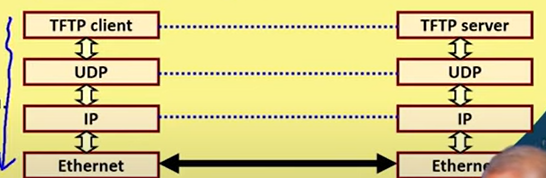

# TCP/IP Protocol Stack

- It is the most fundamental protocol used in internet
- It is the standard way in which all networking devices interat with each other
- Funded by the US military's ARPA
- It is similar to OSI model but is simplified and has only 4 layers

## TCP/IP vs OSI

## Data Flow in TCP/IP Protocol

## TCP/IP Protocol Suite

- It is the group of protocols built using datagrams

1. At the lowest layer (Datalink) there is ethernet.
2. At the network layer there are IP, ICMP, IGMP, ARP and RARP.
3. At the transport layer there is TCP[^1] and UDP[^2].
4. At the final layer (Application layer) there are various application processes like FTP[^3], TFTP[^4], SMTP[^5], SNMP[^6], DNS[^7] etc.

[^1]: Transmission Control Protocol
[^2]: User Datagram Protocol
[^3]: File Trasnfer Protocol
[^4]: Trivial File Transfer protocol
[^5]: Simple Mail Transfer Protocol
[^6]: Simple Network Management Protocol
[^7]: Domain Name System

### Some of the aforementioned protocols at the Network Layer

- Address Resolution Protocol (ARP):
    - It maps the IP address to the hardware (MAC) address
- Reverse Address Resolution Protocol (RARP):
    - It maps the hardware address to the IP address
- Internet Control Message Protocol (ICMP):
    - It is used to send or recieve error messages and reports by network devices
- Internet Group Control Protocol (IGCP):
    - A node send the multicast group membership data to its adjacent devices using this protocol

## IP

- IP transports data from a source node to its destination node in the form of packets
- This is called routing
- It breaks larger packets into smaller packets if necessary
- Since it uses datagrams, it has the same disadvantages as datagrams

## TCP

- It provides a connection-oriented, reliable service for sending messages
- It splits messages into packets
- It reassembles the packets at the destination
- It retransmits the lost packets
- It sends each packet to IP for delivery
- It performs error control

## UDP

- It is connection-less and unreliable
- It only transmits messages which can be fit into a single packet
- It doesn't split data into packets
- It is simpler and faster than TCP
- It doesn't care about error control
- It just acts as a transport layer and sends the packets to IP for delivery

## Addresses

1. Physical Address:
    - At the lowest layer, i.e. Physical or Datalink Layer
    - It is a 48 bit address which uniquely identifies the physical connection
2. IP Address:
    - At the Network Layer
    - It is a 32 bit address which uniquely identifies a network interface
3. Port Address:
    - At the Application Layer
    - It is a 16 bit address which uniquely identifies an application process

## Encapsulation

- As data flows down the network protocol stack, headers (and trailers) get appended to it.
- Similarly, when the data moves up the protocol stack, headers (and trailers) get stripped off it.

Lets take an example of a TFTP request (of 200 bytes):

- So when the data is passed through the TFTP application layer, a header of 4 bytes is appended to it
- Next when it passes through the UDP transport layer, a header of 8 bytes is appended to it
- When it passes through the IP network layer, a header of 20 bytes is appended to it
- Finally when it reaches the Ethernet datalink layer, a header of 14 bytes and a trailer of 4 bytes is appended to it.
- Similarly, when the request reaches the server side protocol stack, each one of its headers and trailers is stripped at the respective layers.