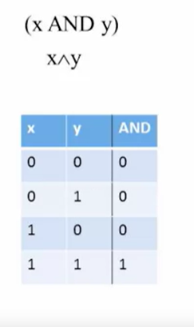
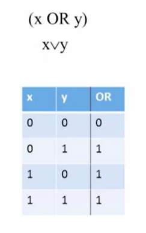
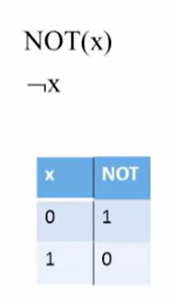
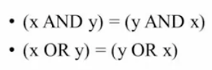
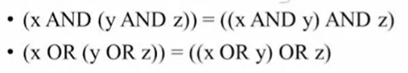
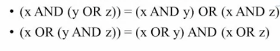
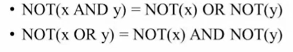

# Boolean Logic

## Boolean Operations

1. The AND Gate

2. The OR Gate

3. The NOT Gate

## Boolean Identities

1. Commutative Law

2. Associative Law

3. Distributive Law

4. De Morgan's Law

5. Idempotence Law

-> X ^ X = X

-> X v X = X

6. Double Negation Law

-> ~(~X) = X

7. 