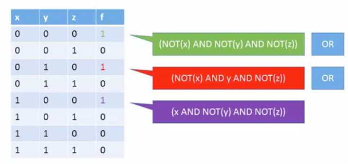

# Boolean Function Synthesis

## Truth Table to Function

1. Traverse row by row and select the rows with result being '1'
2. Build expressions for those particular rows which results in '1' only for thsoe rows and '0' for the others
3. Combine these expressions with the OR operation

Example:

## Theorem

Any boolean function can be represented using an expression containing NAND operators. 

### **Proof**:

* NOT(x) = (x NAND x)
* x AND y = NOT(x NAND y) = ((x NAND y) NAND (x NAND y))