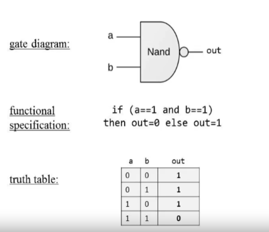
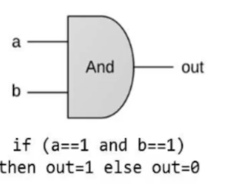
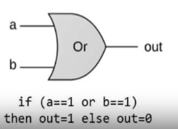
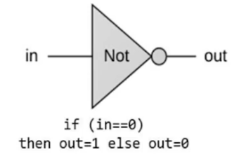
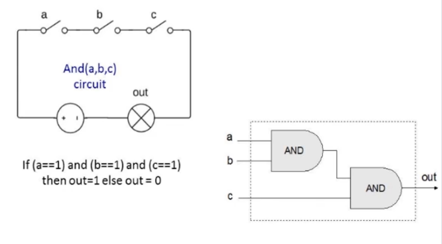

# Logic Gates

There are two types: 
* * Elementary - AND, OR, NOT, NAND, NOR
  * Composite - MUX, DEMUX, Half-Adder, Full-Adder, etc

## Elementary Gates

1. The NAND Gate

2. The AND Gate 

3. The OR Gate

4. The NOT Gate

## Gate interface and implementation

* **Gate Interface**: It tells us what the gate actually does.
* **Gate Implementation**: It tells us how it does, that is how exactly the operation is carried out by the gate.

An example:

.png>)

## Circuit Implementations

Logic gates can be implemented physically using electrical circuit connections. Typically boolean '1' is represented by the 'switch on' state of the bulb and the boolean '0' is represented by the 'switch off' state of the bulb.

