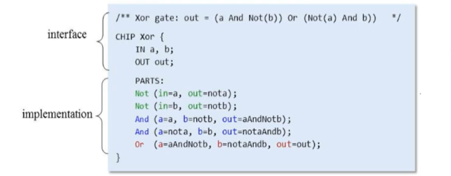

# The HDL ([refer](https://drive.google.com/file/d/1dPj4XNby9iuAs-47U9k3xtYy9hJ-ET0T/view))

The HDL or Hardware Description Language is the description of the design of a hardware component. It is static and non-executable. We can se that the order of statements here does not matter. 

A HDL program consists of 2 parts:

1. The interface
2. The implementation

## Interface

It is usually the definition of the chip (or a logic gate) we are supposed to design. There can only be one (unique) interface of a chip.

## Implementation

It is the design of the chip we are going to build. There can be multiple implementations for a chip.

## Points to be noted

* It is a declarative language.
* The order of statements doesn't matter.
* The iterface of every part that we use must be known beforehand.