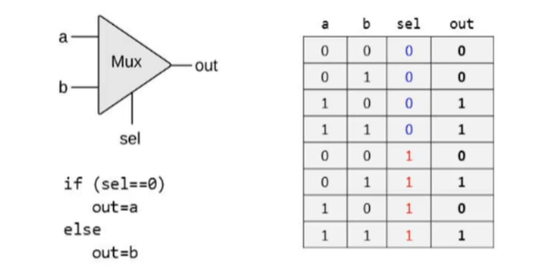
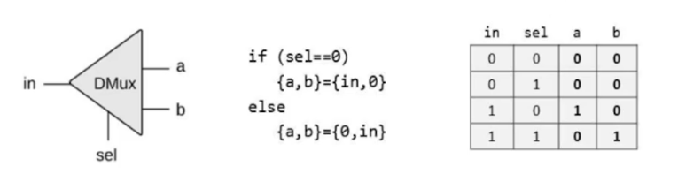
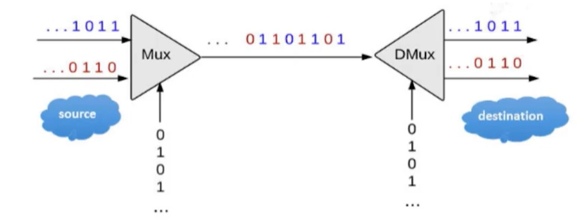

# Gates

## Multiplexor

A multiplexor (or *mux*) outputs one of the inputs based on the selector signal given to it.

## Demultiplexor

A demultiplexor (or *demux*) takes a single input and passes it to either one of its output channel depending on the selector signal given to it.

* It acts exactly opposite to  the mux

## Use of Multiplexing and Demultiplexing in Communication

Multiple messages can be transmitted through a single channel using this logic.

1. The messages are first fed into a *mux* at the source.
2. The selector line is connected to an oscillator
3. Hence the messages are encoded and transmitted
4. The *demux* at the source recieves this signal as the input
5. An oscillator is connected to the selector line
6. The messages are, hence, seperated.