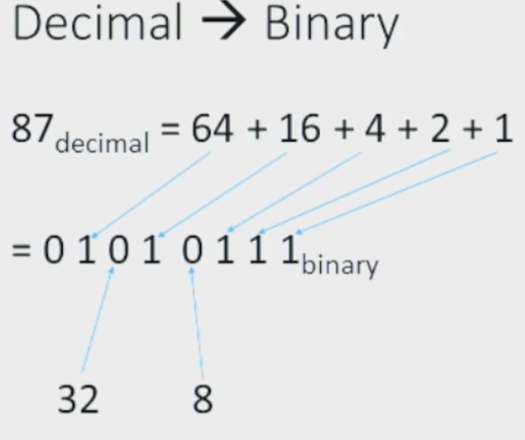

# Binary Numbers

Decimals can be converted into binary numbers.

1. Step-1

    Split the decimal into the sum of multiples of 2.

    

2. Step-2

    Substitute the multiples which are present with 1 and the place of ones absent with 0.
    
    