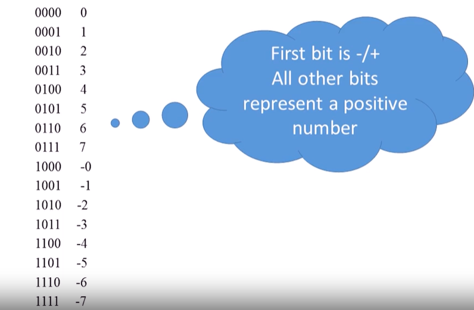
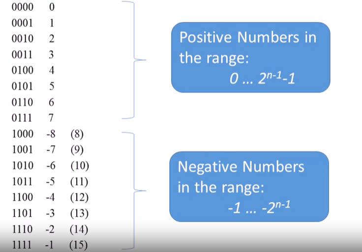
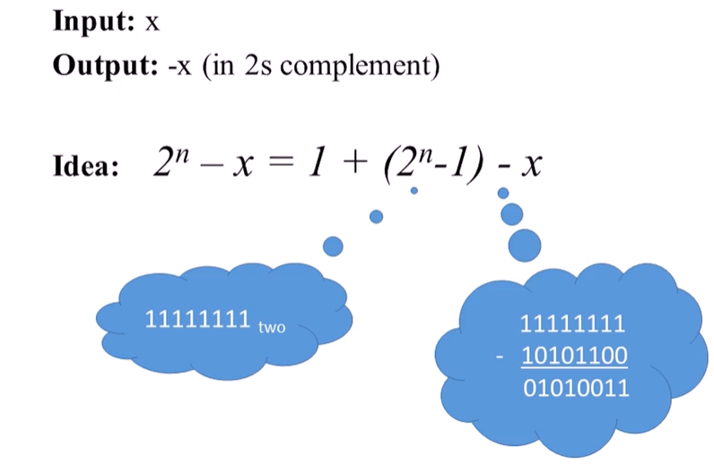

# Negative Numbers

## Sign Bit

* This is not used because there exists a negative 0 in this system which may cause trouble in future implementations

## 2's Complement

* The negative number x in this system is represented using the positive number 2n - x

## Computing -x

