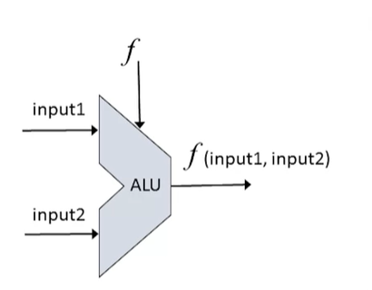
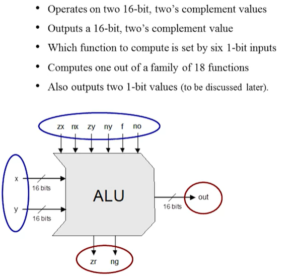
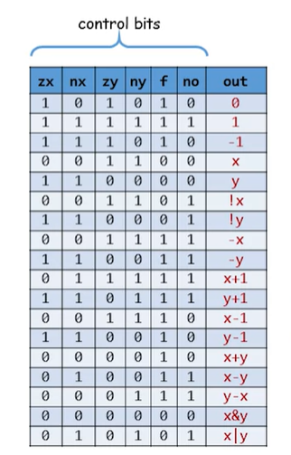
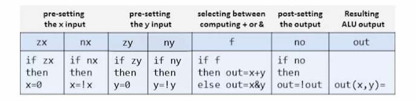
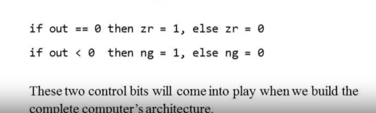

# The Arithmatic and Logical Unit

The ALU has 2 multi bus inputs (`input1` and `input2`) and gives out one output(`f(input1, input2)`). The inputs are used againts a function `f` given to it.
* `f` is one out of the pre-defined arithmatic and logical functions.

The operations done by it are:
* Arithmatic Operations: Addition, Subtraction, Multiplication, Division etc.
* Logical Operations: AND, OR, XOR, etc

Some of the functionality can be kept off to be completed by the software instead of the hardware doing it

## The Hack ALU

### Operation

