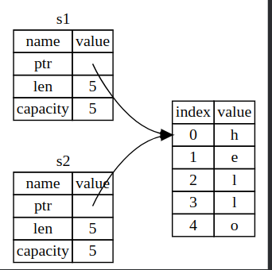
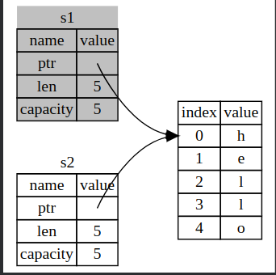

# Ownership

1. Every value in a rust program has a variable as its `owner`
2. For every value there can only be one owner
3. The variable will lose its `ownership` of the value if it goes out of `scope`. This is because rust calls a function called `drop` which deallocates any memory from the heap given to a variable when it goes out of scope.
    - The drop function is implicitly called when a variable goes out of scope, and this is primarily for values that are allocated on the heap. Rust automatically calls drop to clean up resources when the owner goes out of scope. This is part of Rust's ownership system that ensures no memory leaks.
4. There exists something called `move` in rust which will move the ownership of a value from one variable to the other
    ```rust
    let s1 = String::from("hello");
    let s2 = s1;
    ```
    - What we think usually happens here is that it copies the pointer, size and capacity of the string to s2 except for the value.
    
    - But there is a problem here. Two pointers are pointing to the same value. We know that whenever a variable goes out of scope, rust calls a function called drop. But then it will free the same memory twice in this case. That is why the following happens.
     
    - When the ownership of the string is completely moved from `s1` to `s2`, s1's ownership is invalidated and whenever we try to access s1, it will throw an error.
5. There is something interesting to note here. This only happens when the memory is allocated on the heap. The following example would clear this up.
    ```rust 
    let x = 5;
    let y = x;
    println!("x = {}\ny = {}", x, y);
    ```
    ```bash
    x = 5
    y = 5
    ```
    - This means there is no ownership movement here as the size is fixed and the value is known at the compile-time, the values 5 are pushed on top of the stack.
    - The crux is that the value is `copied`
    - The Copy trait is implemented for types like i32, f64, and other small, fixed-size types. When a value implements Copy, a bitwise copy of the value is made when it is assigned to another variable. Hence, both x and y contain independent copies of the value 5.
